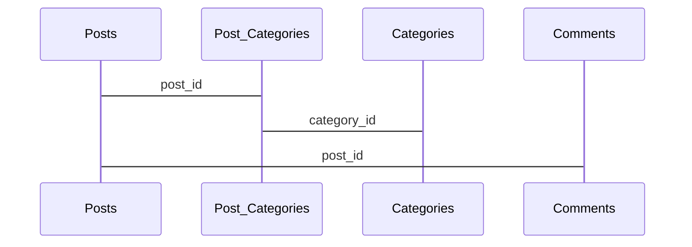

## Synopsis

This is a blog that works with a database and can be used to post & read articles and sort them by categories.   
## Demo

 [ The Live Demo](http://maijagrudule.com/mimi/blog)  where you can see the user and admin part of the blog .

## Database

The database table structure can be found in the Documentation folder.
This blog uses 5 tables:
* **Posts** - used to store posts & post settings like delete status, comments on/off or pause
* **Categories** - used to store categories and descriptions
* **Posts_Categories** - used to link articles to multiple categories
* **Comments**   - used to store comments and link to posts
* **Shortcuts** - used to store user defined shortcuts and expansions for typing assistance

# Functionality

## ADMIN SIDE

The site has reader part (public) and ***admin panel*** for posting & other functions.
The admin panel consists of 5 tabs:

### Post new articles
The user can post an article and  can set ***multiple categories*** for an article. The text-box expands shortcuts that can be dynamically added in the shortcuts tab.
>Extras: When blogger submits a post without category added a default category of *undefined* is set.
### Edit articles
The user can see an overview of all the articles and preform 4 actions (all using AJAX):
 - ***Delete/Restore post*** - toggles between weather the article is published
   on reader side.

 - ***Comments*** manages the status of comments on the reader side
	 - **on**  - by default comment option is on
	 - **off** - off turns comments off and hides any existing comments
	 - **pause** -disables new comments from being posted, but sill displays existing comments to the reader

### Set categories
Blogger can  add ***new categories & descriptions*** in this tab. Also a list of existing categories is displayed.

### Edit comments
Blogger can see comment overview per article and post date and ***toggle between removing/restoring the comment*** (AJAX).
### Add Shortcuts
Blogger can add new shortcuts and update the shortcut list (AJAX).
>Shortcuts are updated dynamically & page tab layout  makes it easy to add new shortcuts even while writing an article (the post text won't disappear!)

## USER SIDE

###  Display categories & Sort by
On the user side categories are added as a ***categories menu bar (for sorting)*** and under every article as a list. The categories are sorted using  [ Isotope plugin](https://isotope.metafizzy.co/)  that is fully responsive and also allows for possible sorting functions.

### Read articles
Articles are displayed as cards and only first sentence is initially shown. To read more users need to click read more.
### Comment & Read comments
Under every article there is a comments section. If comments are disabled the article card doesn't show comment bubble, if comments paused the bubble is greyed out. User can submit a comment and chose to add a user name (not required). After submit user can immediately see his comment.  

## Extras

 - Comments bubble show the number of comments in an easy overview.
 -  Use of AJAX load makes management of comments/articles easy and fast.
 -  The use of tabs on admin panel side allows for easy one-page management of posting.
 - The categories have also description column, this is
   being used for example to give users extra information about certain
   category. In the demo blog, if you hover over category select button
   then description will show in the tooltip.

## Planning
The scrum board can be found  [ Trello](https://trello.com/b/uvANRdY6/w4-blog-planning)  .
The most important aspect of this project planning was to account for possible expansions and plan and setup the file/folder structure accordingly.

## Planned improvements
* Update *comment, add new post and categories function to*  send with AJAX request instead of PHP form submit.
* Add sort-by date/comment count function to the reader menu.
